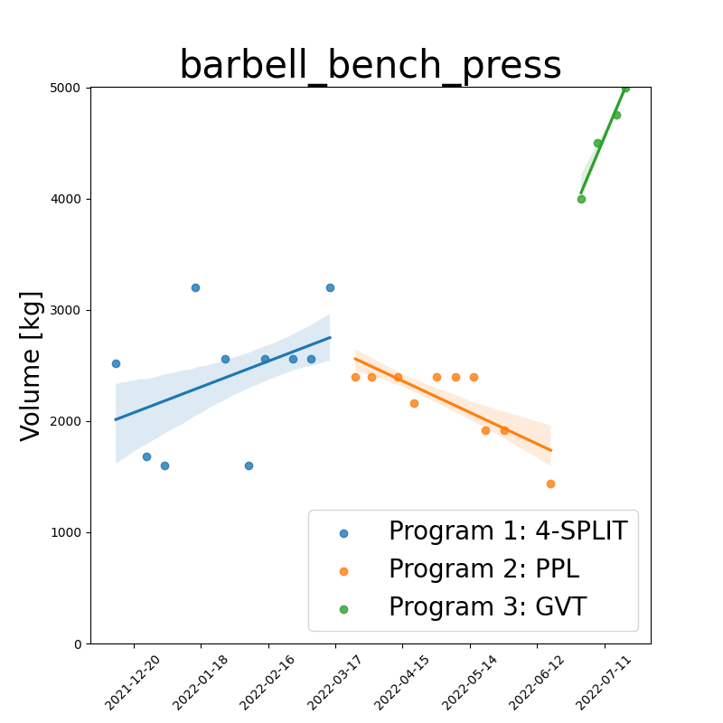

# Fitness-Tracker

<!--  -->

## Intro

Full stack fitness tracking application using TinyDB and FastAPI.
Add weight-training logs continuously to db.json and query the data through the browser.
Visually inspect your progression through dates and exercises

## Getting started

### Run FastAPI app with Docker from CLI:

`docker-compose up`

Alternatively, 
`docker build -t ftimage .` 
`docker run -d -p 8000:8000 --name ftcontainer ftimage`

### Update docs:

`cd docs` 
`make clean` 
`sphinx-apidoc -o ./source ../src` 
`make html`

## Features

- FastAPI app "Fitness-Tracker", with TinyDB backend, exposed through Docker container
- Program logging (Located in folder: logs)
- Plotting (with the Seaborn library. Located in folder: img)
- Documentation (auto-generated by Sphinx and hosted on readthedocs: https://fitness-tracker.readthedocs.io/en/latest/index.html# )
- Multiple unit test suites (Pytest)
- BDD (Behavior Driven Development, using the Behave framework)
- Multiple GitHub Actions workflows
- Data quality validation (Great Expections)
- Package dependency management (Poetry)
- KPI tracking: 1-Rep-Max estimation (Epley and Brzycki formulas)
- Realistic workout data simulation (with naturally progressing trend over time)
- Catalogue of musclegroups, corresponding exercises and suggested weight ranges (for simulations)

## Examples

<b>You can analyze your weight training workouts bot in term of 1RM, or volume.
See examples for each type of analysis below.</b> 

Below: workout-date vs training volume (product between sets, reps and weight) 
for different training programs, together with their regression fits/trendlines 
using 68% confidence intervals. (Each program is shown in the legend)

| barbell_bench_press_volume                                                                  | squat_volume                                                    |
| ------------------------------------------------------------------------------------------- | --------------------------------------------------------------- |
|  |  |

Below: key exercises for overall strength indications. 
Each figure displays workout-date vs 1-rep-max estimate for different training programs, 
together with their regression fits/trendlines using 68% confidence intervals. 
(Each program is shown in the legend)

|                        |            |
| :--------------------------------------------------------------------------------------: | :--------------------------------------------------------------------: |
|  |  |

<!-- Below: comparison between first leg workout of program 1
and last leg workout of program 2 for three selected exercises. 

|  |  |
| :---------------------------------------------------: | :--------------------------------------------------: | -->

<!--
## Upcoming features
- deploy and host containerized app on Raspberry Pi
- Add muscle groups to log file name
- ML models (Scikit Learn)
- YAML-support
- Bodily strength-ratio tracking (determine baseline, ideal-ranges, and compare the two)
- Dashboard
- Add key exercises (benchpress, squat, deadlift) to dashboard
- Hosting on PyPi (automated deploy with GitHub Actions)
- Identify musclegroups and exercises with best or worst progression
- Add cardio tracking (integrate app with Strava)
-->
